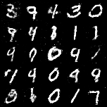

# GANs-implementation
  
Implementation of GANs research paper.

"Generative adversarial networks are a class of artificial intelligence algorithms used in unsupervised machine learning, implemented by a system of two neural networks contesting with each other in a zero-sum game framework. They were introduced by Ian Goodfellow et al. in 2014"

This implementation tries to produce fake MNIST dataset using GANs.

### Working:

### Research Paper Implemented:

Generative Adversarial Networks (2014) - https://arxiv.org/abs/1406.2661

### Result:

